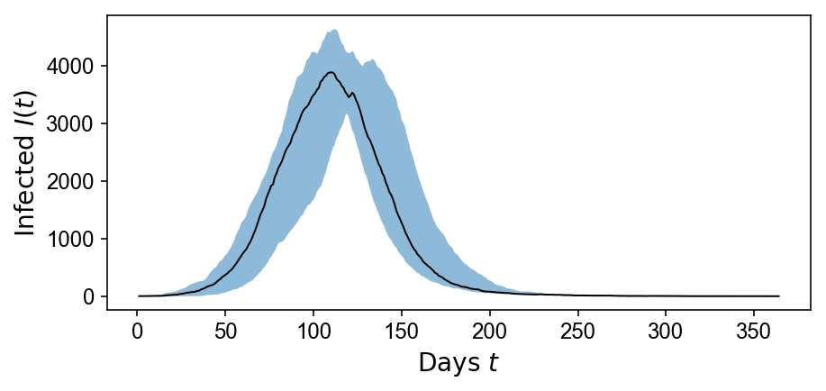
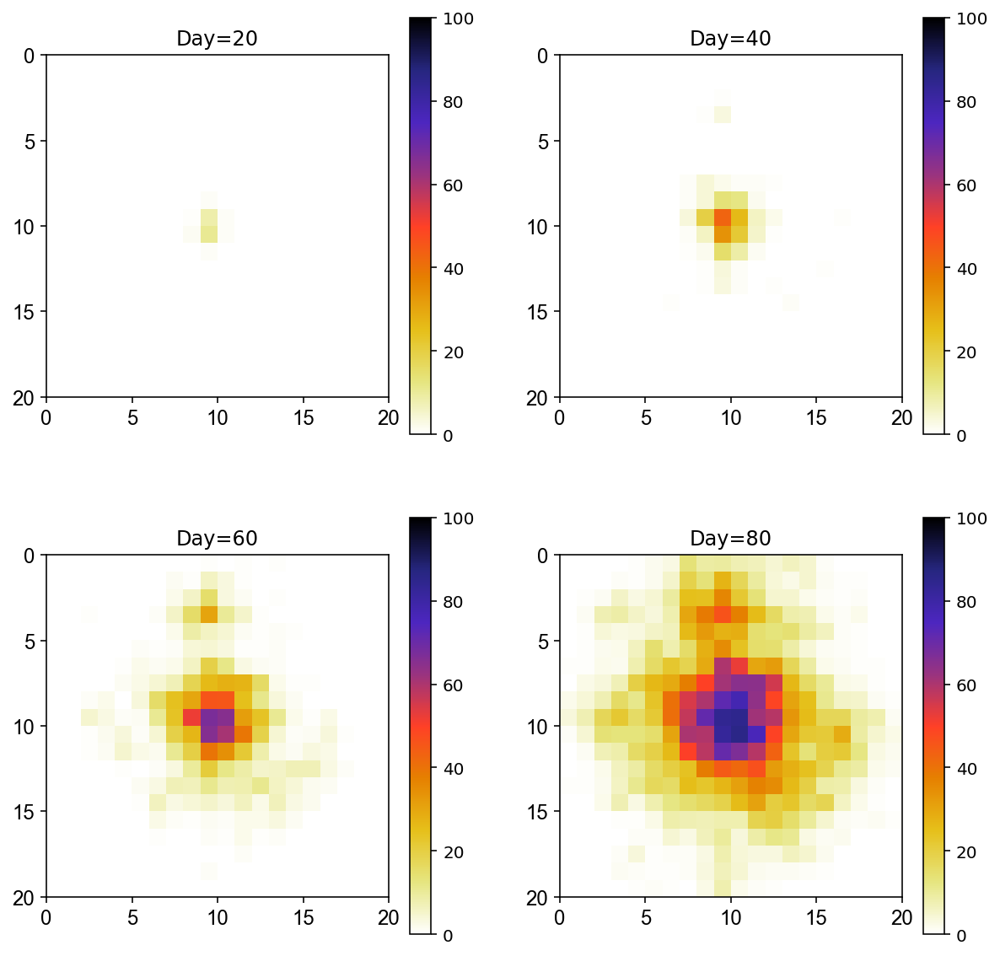

# Mosquito born disease dynamics with human mobility

We developed a python framework that allow the user to run a MPI C++ simulations from zero to study an agent based model for modelling the interplay between mosquito-borne disease and human mobility. 

This repository contains:
  
  1. A C++ code
  2. A python jupyter notebook 

## 1. The Agent Based Model
In this work we explore the effects of human mobility on the dispersion of a vector borne disease using an agent based model. I combine an already presented stochastic model for dengue with a simple representation of the daily motion of humans on a schematic city of `20x20` blocks with `100` inhabitants in each block. The pattern of motion of the individuals is described by the connection between different blocks and the length distribution of the movements follows a truncated Levy Fligth distribution.

An Agent Based Model is adopted in order to explicitly simulate the epidemic spread of the disease as governed by the transmission dynamics of the Dengue virus through human-mosquito interactions and promoted by the population movements across the city. The physical environment in which the epidemic and the mobiliy dynamics take places is the grid `G`  described above. We assume a constant human population `N`, and model each individual as an agent who makes two daily trips between its home `H` and work `W` locations. In our model mosquitoes don't travel. The agents travel with a distance that is given by a Levy-Flight distribution as shown in the following:

The C++ code implement an agent-based dengue transmission model in which humans and mosquitoes are represented
as agents and humans go through the epidemic states of dengue. To model dengue dynamics, we use a stochastic population model based on the ordinary differential equation (ODE) framework employed by Barmak et al. (https://www.sciencedirect.com/science/article/pii/S0378437115010420). The physical environment in which the epidemic takes place is the grid `G` described above. We assume each agent to be susceptible to the virus initially. Upon challenge with infectious mosquito bites, individuals enter the incubation phase with mean duration of given days, later becoming infectious for given days and finally recovering with life-long immunity.

### 1.1 Requirements
You can run the simulations on multiple cores. Be sure to have installed `open-mpi` on your system. The code and the functions are in the folder `Code` 

## 2. The Python Notebook
The Notebook allow to:

1. Create the input for the simulations
2. Run the simulations
3. Analyze the results

### 2.1 Create the input for the simulations
I generate a square grid of `self.gs = 20` cells per side (that you can change) in which `self.nc = 100` agents are placed. The distance between two cells is `self.r0 = 100`. Agent are placed in the grid where the distance home-work follows a truncated Levy-flight distribution `p(r) \sim (r + self.r0)^{-self.a}*exp(−r/self.k).`

        self.r0 = 100  ## Distance between cells
        self.a = 2
        self.k = 1500
        self.gs = 20 ## Cells per side
        self.S = self.gs*self.gs ## Grid Size
        self.nc = 100 ## Number of habitants per cells
        self.N = self.nc*self.S
        self.hc = []  ## home work
        self.wc = []  ## home work
In this first part the notebook generates the network of movement and the number of initial aquatic and adult mosquitoes in ech cell. 

        net.to_csv('Code/networkSimulations/realNetwork.dat', sep=' ', header=None, index=None)
        adult.to_csv('Code/Initial/adult.dat',  sep=' ', header=None, index=None)
        aquatic.to_csv('Code/Initial/aquatic.dat',  sep=' ', header=None, index=None)
        
I also set `10` initial exposed individuals in the central cell

        ## define central cell cc
        cc = int((mos.gs*mos.gs) / 2 + mos.gs/2)
        initI = pd.DataFrame()
        initI['cell']=cc
        initI['I']=10
        initI.to_csv('Code/Initial/initial.dat',  sep=' ', header=None, index=None)
        
### 2.2 Compile and run the C++ program
First of all we need to set the parameters of the transition rates of the model as well as the number of simulations `s` for each run and the bite rate `br` and the maximum number of mosquito per person in each cell `xv`. All the parameters here are constant but some of them could be function of the daily temperature.

        s = 10   ## number of simulations
        xv = 0.1 ## mosquito per humans
        br = 0.25 ## bite rate
        #### HUMANS (rate of infection)
        SE = 0.5 ## Humans: S ---> E
        EI = 0.15 ## Humans: E ---> I
        IR = 0.143 ## Humans: E ---> I
        #### ADULT MOSQUIT (rate of infection and mortality rate)
        SEm = 0.75;  ## V: S->E
        EIm = 0.1;   ## V: E->I
        MUv = 0.04;  ## Probability to die for adult mosquito
        ### AQUATIC  (rate of transition aquatic to adult and mortality rate)
        MUa = 0.04;  ## Probability to die for acquatic mosquito
        ASm = 0.04;  
        VA = 0.4;   ## V: A->V
        
Then you we compile and run (`-np 1` are the number of processors used)

        ! mpicxx -o main main.cpp Node.cpp Agent.cpp -std=gnu++11
        ! mpirun -np 1 ./main {s} {xv} {br} {SE} {EI} {IR} {SEm} {EIm} {MUv} {MUa} {ASm} {VA}
        
        
## 3 Results

Here the number of infected individuals over the time.

In the next figure we report the spatio-temporal distribution of the disease outbreak in a schematic city.

As intial condition, 5 exposed humans are placed in the central cell. We showed the number of recovered individuals in each cell over the time.

### 3.1 Varying commuters traffic

In this section we show the changes of the outbreks by varying the fraction of commuters in each cell. In the previous section we showed the results by considring that the 20% of agents live and work in the same cell while the 80% of agent commute everyday between their home and work location. In the next figure we show the number of recovered individuals for different values of commuters.

